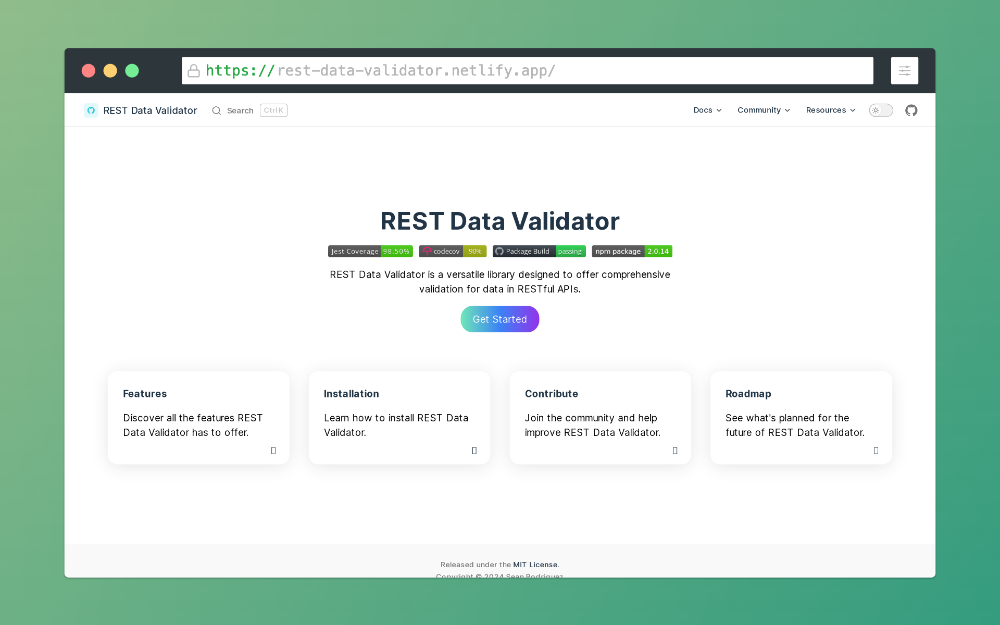

# REST Data Validator


[](https://codecov.io/gh/SeanLuis/rest-data-validator)
[](https://github.com/SeanLuis/rest-data-validator/actions/workflows/build.yml)
[](https://badge.fury.io/js/rest-data-validator)

REST Data Validator is a versatile library designed to offer comprehensive validation for data in RESTful APIs. It supports a wide range of data types, validation rules, and is designed with extensibility in mind, making it ideal for ensuring data integrity and compliance with API specifications.

### For more detailed, visit: [.:: Documentation ::.](https://rest-data-validator.netlify.app/)



## Features

- **Comprehensive Validation**: Supports validation of strings, numbers, emails, dates, enums, files, and custom formats.
- **Decorator-based Validation**: Utilizes TypeScript decorators for easy and declarative validation directly in your class models.
- **Schema File Provider**: Load and convert schema definitions from JSON or YAML files into validation schemas, allowing for flexible and manageable validation configurations.
- **Extensive Validation Schemas**: Offers a wide range of validation schemas to validate various data types and structures in a scalable and flexible manner.
- **Flexible and Extensible**: Easily extendable to include custom validation rules and logic.
- **Framework Agnostic**: Can be used with any server-side framework or library, such as Express, Koa, or Fastify.
- **Full TypeScript Support**: Leverages TypeScript for type safety and enhanced developer experience.
- **Custom Error Messages**: Allows defining custom error messages for each validation rule to provide clear and specific feedback.

## Installation

Npm:

```bash
npm install rest-data-validator@latest
```

Yarn:

```bash
yarn add rest-data-validator@latest
```

Pnpm:

```bash
pnpm add rest-data-validator@latest
```

### Using Decorators for Validation

Decorators provide a declarative way to add validation rules directly to your class properties.

### Custom Validation Rules

You can easily extend the library to include custom validation rules and logic.

## Schema File Provider

The `SchemaFileProvider` allows you to externalize your validation schemas into JSON or YAML files. This makes the validation process more flexible and easier to manage, especially for large or complex schemas.

### Key Features

- **Load Schemas from Files**: Load schema definitions from ```JSON``` or ```YAML``` files.
- **Convert Definitions to Schemas**: Convert loaded schema definitions into validation schemas that can be used throughout your application.

## Validation Schemas

REST Data Validator provides a comprehensive set of validation schemas to validate various data types and structures. These schemas are designed to be flexible and reusable, enabling developers to build complex validation logic easily.

### Available Schemas

- **String**: Validates string values with support for constraints like minimum and maximum length.
- **Number**: Validates numerical values with support for constraints like minimum and maximum values.
- **Boolean**: Validates boolean values.
- **Object**: Validates objects based on a schema definition for each property.
- **Array**: Validates arrays and allows setting constraints on the array's length and its elements' schema.
- **Union**: Validates a value that can match any one of the provided schemas.
- **Enum**: Validates that a value is one of a predefined set of allowed values.
- **Date**: Validates date values with support for constraints on the date range.
- **Tuple**: Validates arrays with fixed length and specific types at each index.
- **Record**: Validates objects where all keys and values match specified schemas.
- **Nullable**: Allows a value to be `null` or satisfy another schema.
- **Any**: Accepts any value without restrictions.
- **Lazy**: Supports defining schemas that are evaluated lazily, useful for recursive or conditional schemas.
- **Literal**: Validates that a value matches a specific literal value.
- **Transform**: Allows transforming the value during validation by applying a transformation function before validating.

## Rest CLI

### Commands

The CLI provides various commands to help you generate and manage validation schemas.

### Model Generation

Generate models with predefined validation rules quickly.

### Validation Generation

Add validation rules to existing models interactively.

## Validators and Decorators

- **ClassValidator**: Validates a class based on its decorators.
- **Number**: Validates numerical properties.
- **Email**: Validates email addresses.
- **Password**: Validates password strength.
- **Date**: Validates date properties.
- **Enum**: Validates that a value is part of a specific enum.
- **File**: Validates file properties.
- **Range**: Validates that a number is within a specified range.
- **Regex**: Validates using a regular expression.
- **Custom**: Allows for custom validation logic.
- **Domain**: Validates domain names.
- **Array**: Validates array properties.
- **Nested**: Validates nested objects.
- **Contextual**: Contextual validation based on other properties.
- **Dependency**: Validation based on other property values.
- **Security**: Validates security-related properties.
- **Alpha**: Validates that a string contains only letters.
- **Contains**: Validates that a string contains a specific substring.
- **BIC**: Validates Bank Identification Codes (BIC).
- **ISO31661Alpha2**: Validates ISO 3166-1 alpha-2 country codes.

## Group-Based Validation

Define validation groups to conditionally apply validation rules.

## Sanitizer Functions

Sanitize input data before validation.

## Validation Utilities

- **Async Validators**: Handle asynchronous validation logic.
- **Nested Validators**: Validate nested objects and arrays.
- **Contextual Validators**: Apply validation rules based on other properties.
- **Dependency Validators**: Ensure properties are validated based on other property values.

## Decorators Utilities

- **Accessors Decorator**: Validate properties with getter and setter accessors.
- **Getter Decorator**: Validate properties accessed via getters.
- **Setter Decorator**: Validate properties accessed via setters.

## Security Utilities

- **Security Validation**: Validate security-related properties.
- **Security Decorator**: Decorate properties with security validation.
- **Security Events**: Handle security-related events.

## Roadmap

The `rest-data-validator` project aims to continually evolve with the needs of developers and the dynamics of RESTful API design. Below is a tentative roadmap of features and improvements we're exploring:

### Upcoming Features

- [X] **Nested Validation Support**: Implement validation for complex, nested data structures to accommodate intricate API schemas.
- [X] **Asynchronous Validators**: Introduce validators capable of handling asynchronous operations, useful for database lookups or external API validations.
- [ ] **Internationalization**: Offer localized error messages to better serve a global user base.
- [ ] **Sanitization Enhancements**: Expand sanitization utilities for preprocessing data, ensuring robust input handling before validation.
- [X] **Framework Middleware**: Develop middleware for seamless integration with popular server frameworks like Express and NestJS.
- [ ] **Runtime Type System Integration**: Explore compatibility with runtime type validation libraries to enhance JavaScript validation capabilities.
- [X] **CLI Tooling**: Build CLI tools for generating validator schemas from TypeScript type definitions, aiding in rapid development cycles.
- [ ] **Plugin Architecture**: Create an extensible plugin system allowing custom validators and sanitizers, fostering community-driven enhancements.
- [X] **Performance Optimization**: Profile and optimize the core validation logic to efficiently handle large datasets and reduce overhead in high-throughput environments.
- [X] **GUI for Schema Building**: Provide a graphical interface for constructing and exporting validation schemas, streamlining the setup process for `rest-data-validator`.

We welcome community input and contributions to help shape the future of `rest-data-validator`. If you have ideas or features you’d like to see, please open an issue to start the conversation.

Note: The roadmap is subject to change and reflects current planning and priorities.

## Contributing

Contributions are welcome! Please read our contributing guide for details on our code of conduct, and the process for submitting pull requests to us.

## Support Us

If you find the REST Data Validator helpful or interesting, please consider giving it a star on GitHub! 🌟 Your support encourages us to continue developing and maintaining this project.

### Why Star Us?

- **Recognition:** A star is a token of appreciation that motivates open-source contributors.
- **Feedback:** It tells us that our work is valued, guiding us on what features or improvements to prioritize.
- **Visibility:** More stars increase our project's visibility, helping others discover this tool.

### How to Star Our Repository

1. Visit the [REST Data Validator GitHub page](https://github.com/SeanLuis/rest-data-validator).
2. In the top-right corner of the page, click the "Star" button.
3. That's it! You've just made our day a little brighter.

Your star is much more than just a number to us – it's a sign that we're on the right track. Thank you for your support, and we hope REST Data Validator helps you in managing and validating your RESTful APIs more effectively.

Feel free to explore the repository, check out the latest updates, and contribute if you can. Together, we can make REST Data Validator even better!

## Author

- **Sean Luis Guada Rodriguez** - [Visit Website](https://sean-rodriguez.vercel.app)

## License

This project is licensed under the MIT License - see the [LICENSE.md](https://github.com/SeanLuis/rest-data-validator/blob/master/LICENSE) file for details.
